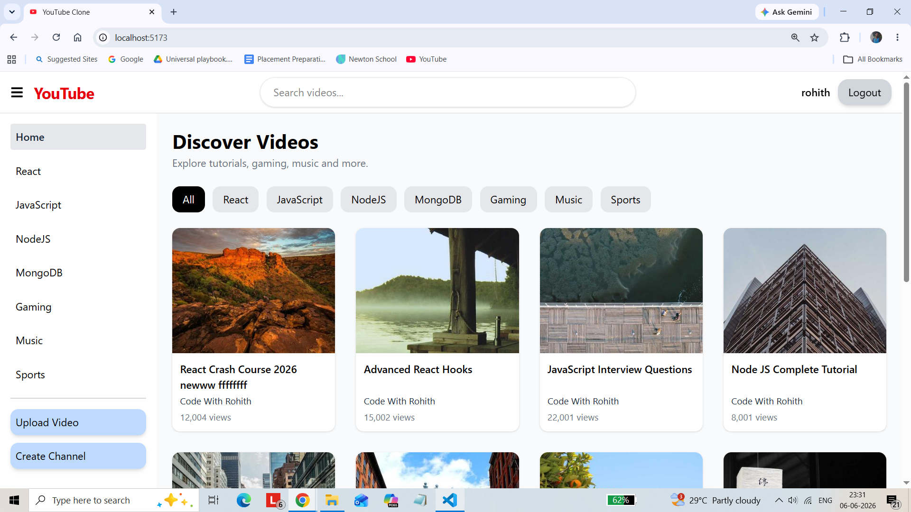
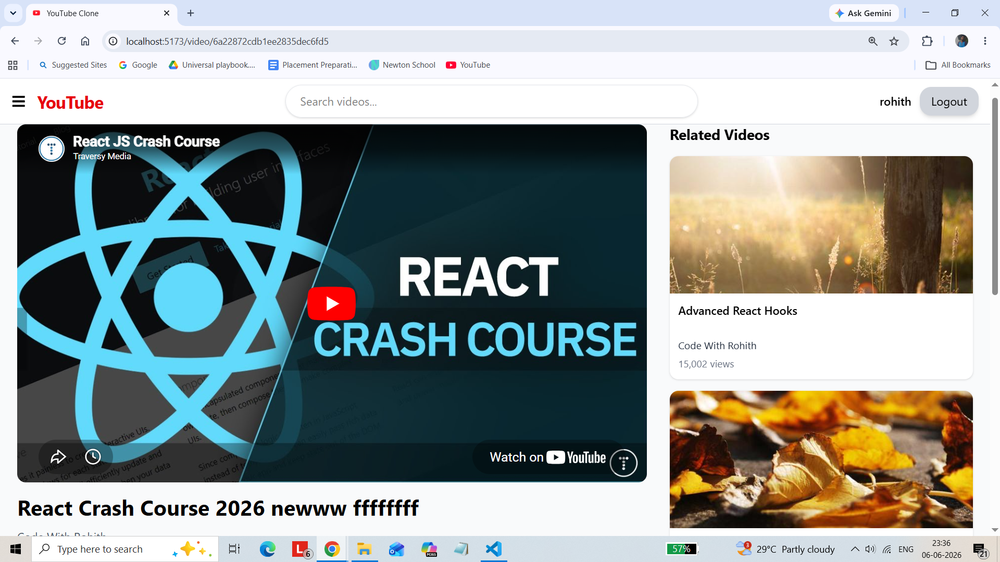
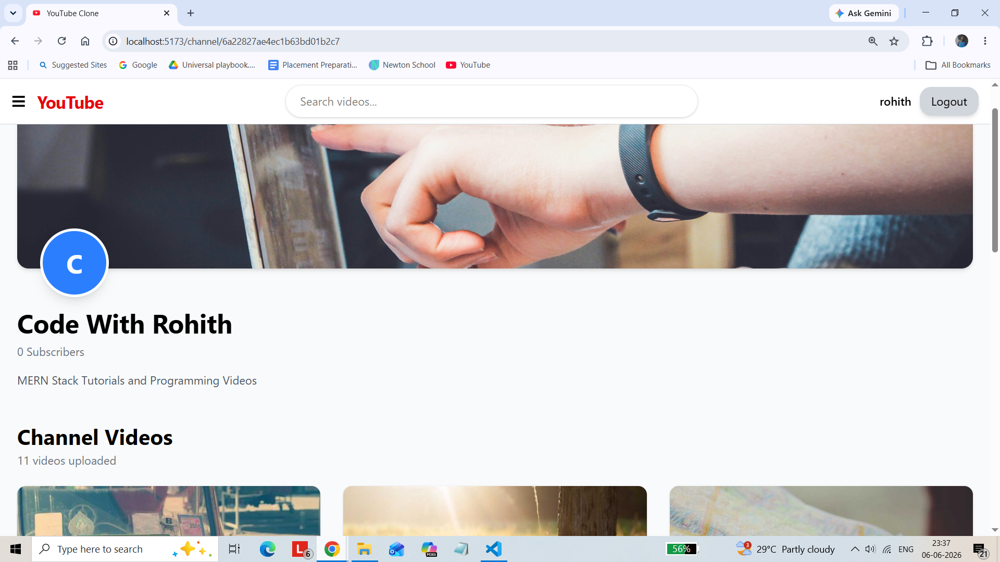
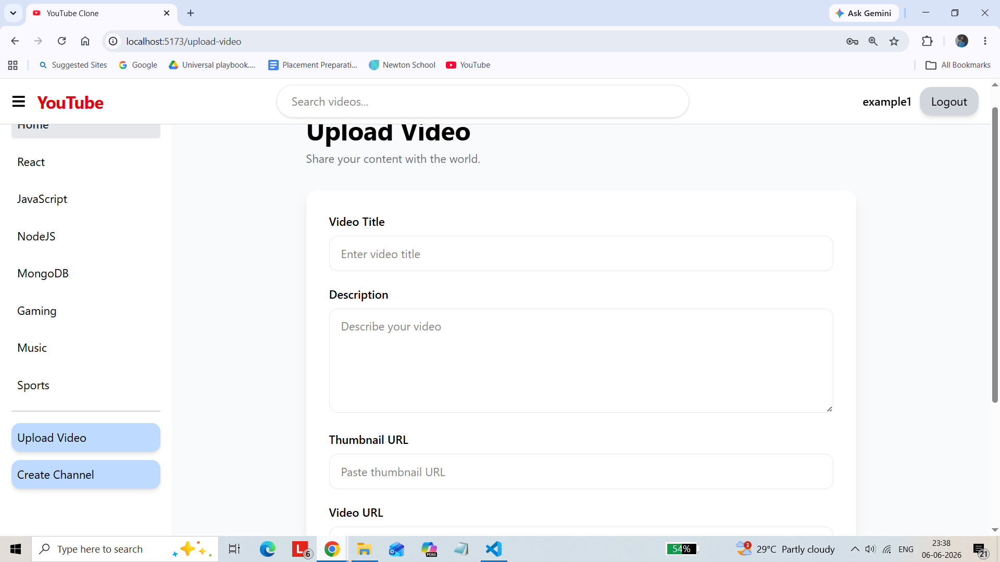
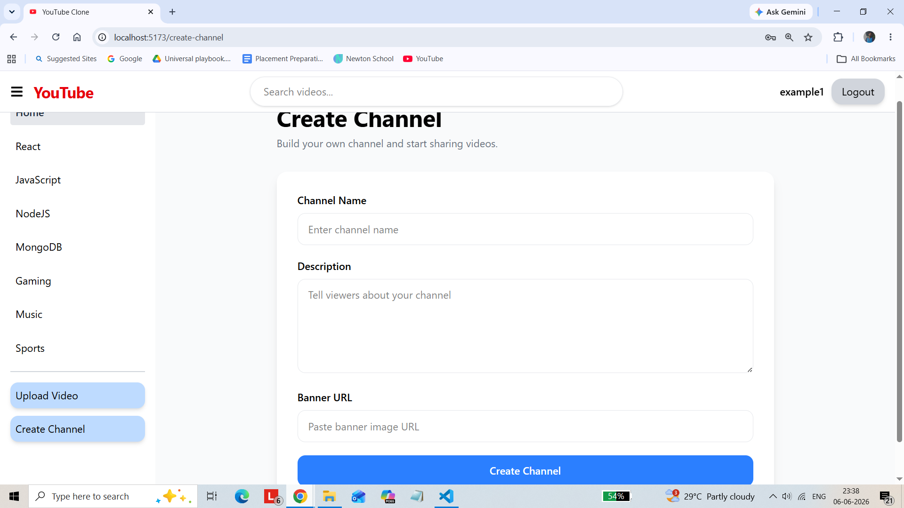

Github repository link : https://github.com/ramrohith999/youtube-clone

# YouTube Clone

A full-stack YouTube Clone built using the MERN Stack (MongoDB, Express.js, React.js, Node.js). Users can create channels, upload videos, like/dislike videos, comment on videos, and manage their own content.

---

## Features

### Authentication

* User Registration
* User Login
* User Logout
* Protected Routes
* Redux Authentication State Management

### Video Management

* Upload Videos
* Edit Videos
* Delete Videos
* View Videos
* Search Videos
* Filter Videos by Category
* Related Videos Section

### Channel Management

* Create Channel
* View Channel Page
* Channel Banner
* Channel Description
* Channel Video Listing
* Automatic Video Upload to User's Channel

### Engagement Features

* Like Videos
* Dislike Videos
* Add Comments
* Edit Own Comments
* Delete Own Comments

### Authorization

* Users can only edit/delete their own videos
* Users can only edit/delete their own comments
* Guests cannot perform restricted actions

### User Interface

* Responsive Design
* Modern Layout
* Sidebar Navigation
* Sticky Header
* Category Filters
* Custom 404 Page

---

## Tech Stack

### Frontend

* React.js
* Redux Toolkit
* React Router DOM
* Axios
* Tailwind CSS
* React Icons

### Backend

* Node.js
* Express.js
* MongoDB
* Mongoose

### Authentication

* JWT (JSON Web Token)
* bcryptjs

---

## Project Structure

```bash
youtube-clone/
│
├── backend/
│   ├── controllers/
│   ├── models/
│   ├── routes/
│   ├── middleware/
│   ├── config/
│   └── server.js
│
├── frontend/
│   ├── src/
│   │   ├── components/
│   │   ├── pages/
│   │   ├── services/
│   │   ├── features/
│   │   ├── layouts/
│   │   └── utils/
│   │
│   └── public/
│
├── screenshots/
│
└── README.md
```

---

## Installation

### Clone Repository

```bash
git clone https://github.com/ramrohith999/youtube-clone
cd youtube-clone
```

---

### Backend Setup

```bash
cd backend
npm install
```

Create a `.env` file:

```env
PORT=5000
MONGO_URI=your_mongodb_connection_string
JWT_SECRET=your_secret_key
```

Run Backend:

```bash
npm run dev
```

---

### Frontend Setup

```bash
cd frontend
npm install
npm run dev
```

Frontend runs on:

```txt
http://localhost:5173
```

Backend runs on:

```txt
http://localhost:5000
```

---

## API Endpoints

### Authentication

| Method | Endpoint           |
| ------ | ------------------ |
| POST   | /api/auth/register |
| POST   | /api/auth/login    |

### Videos

| Method | Endpoint                |
| ------ | ----------------------- |
| GET    | /api/videos             |
| GET    | /api/videos/:id         |
| POST   | /api/videos             |
| PUT    | /api/videos/:id         |
| DELETE | /api/videos/:id         |
| PATCH  | /api/videos/:id/like    |
| PATCH  | /api/videos/:id/dislike |
| PATCH  | /api/videos/:id/view    |

### Comments

| Method | Endpoint               |
| ------ | ---------------------- |
| GET    | /api/comments/:videoId |
| POST   | /api/comments          |
| PUT    | /api/comments/:id      |
| DELETE | /api/comments/:id      |

### Channels

| Method | Endpoint                    |
| ------ | --------------------------- |
| POST   | /api/channels               |
| GET    | /api/channels/:id           |
| GET    | /api/channels/:id/videos    |
| GET    | /api/channels/owner/:userId |

---

## Screenshots

Add screenshots inside the `screenshots` folder and reference them here.

### Home Page



### Video Player



### Channel Page



### Upload Video



### Create Channel



---

